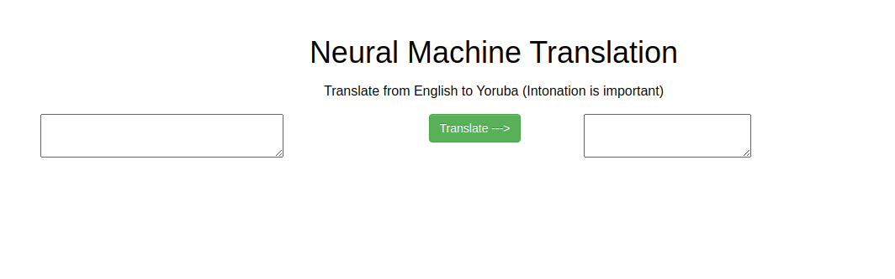

## Deploying language Model to Google cloud

The app is a wrap up for the Language model series on [medium](https://heartbeat.fritz.ai/exploring-language-models-for-neural-machine-translation-part-one-from-rnn-to-transformers-3e53b7d8a01f?source=---------9----------------------------)

The web app is built to translate from one Language (English) to another (Yoruba), With simple interface. Check out this [post]() i wrote on how to deploy the app

